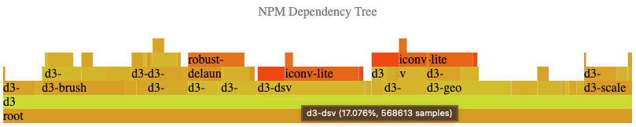

# Deps flame graph

This is a very rudimentary script to visualize the size of a given npm project's dependencies.

It was written via a series of ChatGPT prompts and then modified to fix minor issues.

## Setup

    nvm i
    npm i

## How to use

    node list-dependencies <path-to-project>

A file named `output.json` will be generated. In order to visualize it, copy its contents and paste them into `index.html`:

    const dependencyTree = <contents>;

Finally, open `index.html` to visualize the result.

## Known flaws

It is only expected to work with completely [deduped](https://docs.npmjs.com/cli/v8/commands/npm-dedupe) dependencies. If one of the dependencies relies on a specific version of a sub-dependency that does not match what other dependencies require, it may break the script. This is because the script is relying on a totally flat dependency tree. If one of the dependencies cannot be deduped, it stores its duped dependency inside its own, particular `node_modules` folder. Since the script does not parse sub-`node_modules` folders, it may miss that dependency.

Also notice that the visualization is not very good, and with many dependencies, the graph quickly becomes unreadable. `d3-sunburst` may be more appropriate for this.

The code was poorly written in half an hour of interaction with ChatGPT, so don't judge me. Feel free to suggest improvements.
